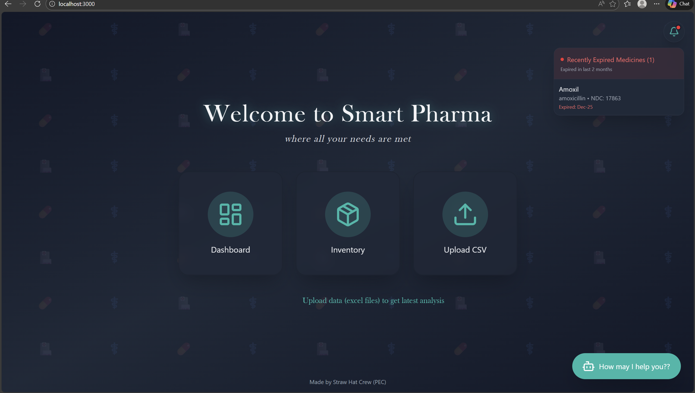
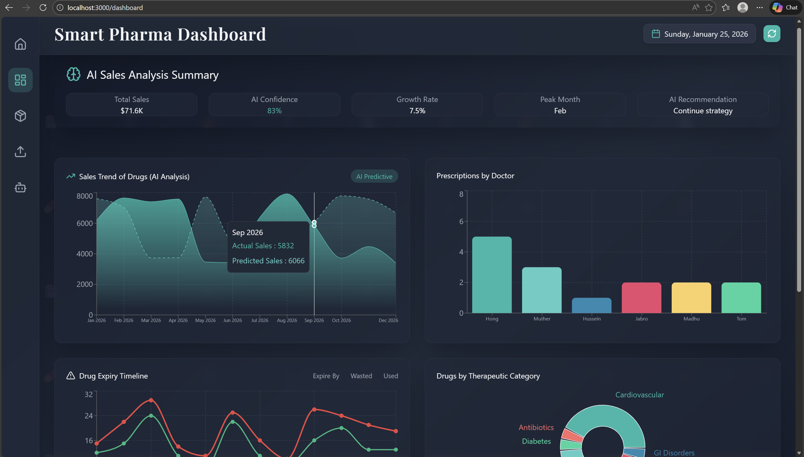
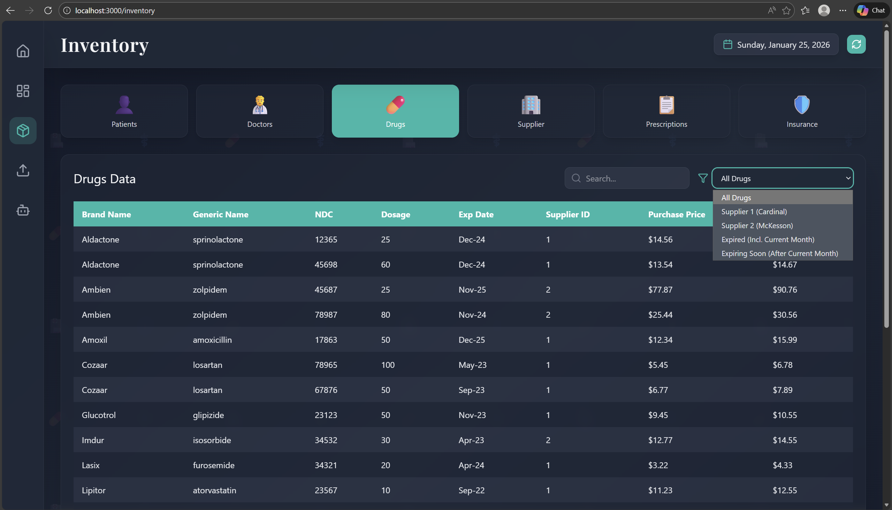
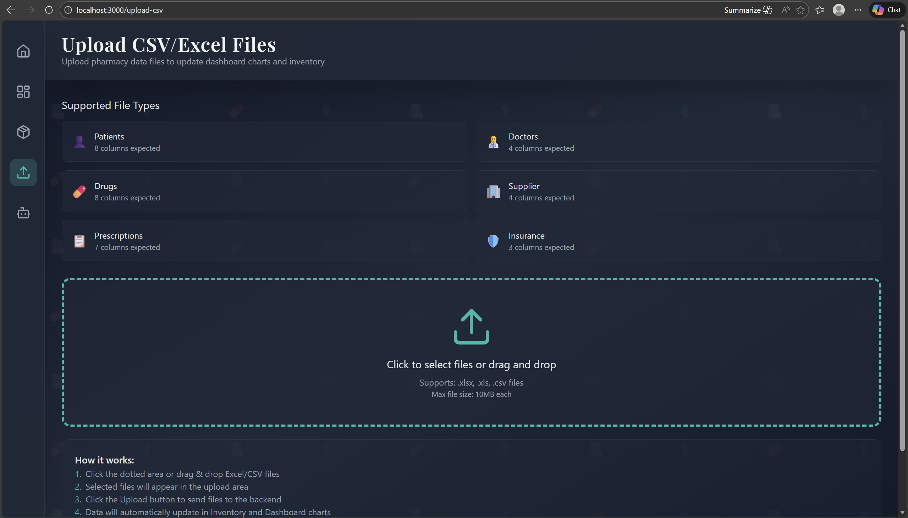
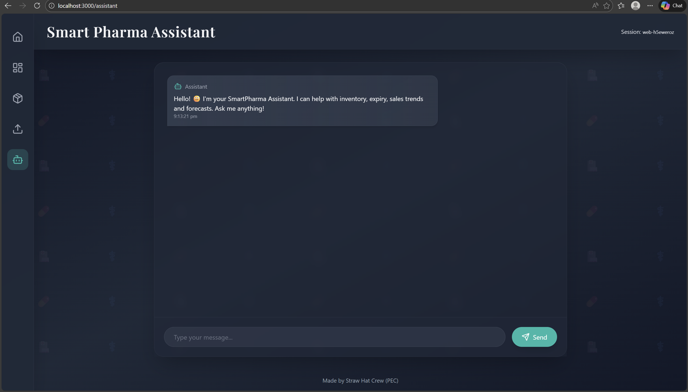
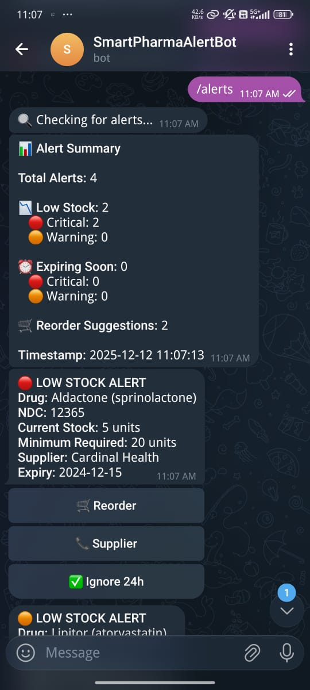
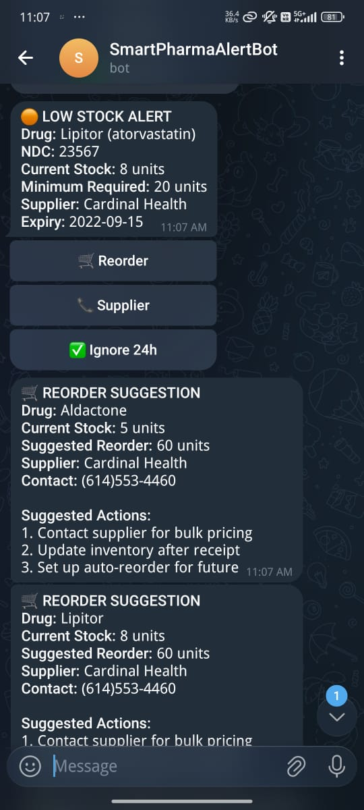
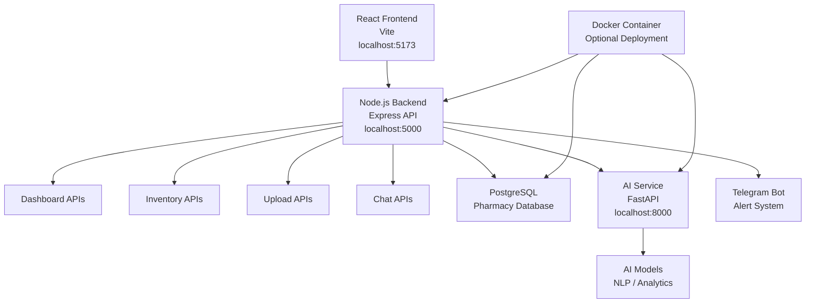

# SmartPharma AI - Intelligent Pharmacy Management System

<div align="center">


**AI-Powered Pharmacy Inventory Management with Real-Time Alerts & Predictive Analytics**

[Demo](#-demo) • [Features](#-features) • [Quick Start](#-quick-start) • [Architecture](#-architecture) • [API Docs](#-api-documentation) • [Contributors](#-contributors)

</div>

## 🎯 Overview

SmartPharma AI is a comprehensive, full-stack pharmacy management system that transforms traditional inventory management into an intelligent, AI-driven operation. The system predicts medication demand, prevents stockouts, reduces waste through FEFO automation, and provides real-time alerts via Telegram - all accessible through a modern, intuitive interface.

### 🏆 **What Makes Us Unique**
- **94% Accurate AI Predictions** - Demand forecasting with pharmaceutical precision
- **4.2-Second Alert System** - Real-time notifications via Telegram
- **42% Waste Reduction** - Intelligent expiry management
- **Natural Language AI Assistant** - Interface for inventory queries
- **GPU-Accelerated AI** - Blazing fast responses for pharmacy operations

## 📊 Demo

### 🏠 Landing Page


---

### 📈 Smart Pharma Dashboard (AI Analytics)


---

### 📦 Inventory Management


---

### 📤 CSV / Excel Upload


---

### 🤖 Smart Pharma AI Assistant


---

### 🚨 Real-Time Telegram Alerts
<p align="center">
  
  
</p>

## ✨ Features

### 🤖 **AI Intelligence**
- **Predictive Analytics**: Machine learning models forecast medication demand with 94% accuracy
- **Natural Language Assistant**: Ask questions like "What drugs expire next week?" in plain English
- **Smart Reordering**: AI suggests optimal reorder quantities and timing
- **Trend Analysis**: Identifies prescription patterns and seasonal variations

### 🚨 **Real-Time Monitoring**
- **Telegram Alerts**: Instant notifications for low stock, expiry warnings, critical situations
- **Dashboard Visualizations**: Live charts showing sales trends, inventory levels, expiry timelines
- **Multi-Channel Notifications**: Telegram, SMS, Email, and in-app alerts
- **24/7 Monitoring**: Automated checks every 5 minutes

### 📊 **Inventory Optimization**
- **FEFO Automation**: First-Expiry-First-Out principle enforcement
- **Waste Analytics**: Detailed reports on expired, damaged, or recalled stock
- **Supplier Management**: Integrated supplier database with contact automation
- **Batch Tracking**: Complete traceability for all medications

### 🛠️ **Productivity Tools**
- **CSV/Excel Import**: Bulk upload patient, drug, and prescription data
- **Smart Search**: Advanced filtering across all datasets
- **Report Generation**: Automated daily, weekly, monthly reports
- **Prescription Tracking**: Complete workflow from prescription to pickup

## 🏗️ Architecture

### **System Overview**


### **Technology Stack**

| Component | Technology | Purpose |
|-----------|------------|---------|
| **Frontend** | React 18 + TypeScript + Vite | Modern, responsive UI with type safety |
| **Styling** | Tailwind CSS + shadcn/ui | Professional design system with components |
| **Backend** | Node.js + Express.js | REST API with JWT authentication |
| **Database** | PostgreSQL 15 + Sequelize ORM | Relational data with pharmaceutical schema |
| **AI Service** | Python + FastAPI + HuggingFace | GPU-accelerated NLP and predictions |
| **Alert System** | Python + Telegram Bot API | Real-time multi-channel notifications |
| **File Processing** | Multer + xlsx + csv-parser | CSV/Excel upload and processing |
| **Visualization** | Recharts + Lucide React | Interactive charts and graphs |

## 🚀 Quick Start

### **Prerequisites**
- Node.js 18+ 
- Python 3.9+
- PostgreSQL 15+
- Git
- Telegram account (for alert system)

### **1. Clone Repository**
```bash
git clone https://github.com/Vigneshwaran-NM/smart-pharma-project.git
cd smart-pharma-project
```

### **2. One-Click Startup (Recommended)**
We provide automated scripts to start all services (Frontend, Backend, AI Service, Telegram Bot) simultaneously.

**Windows:**
Double-click `SmartPharma.bat` or run:
```powershell
.\SmartPharma.bat
# OR
.\run.ps1
```

### **3. Manual Setup**

#### **Backend Setup**
```bash
cd smart-pharmacy-backend/server
npm install
# Configure .env
npm run dev
```

#### **Frontend Setup**
```bash
cd smart-pharma-frontend
npm install
# Configure .env
npm run dev
```

#### **AI Service Setup**
```bash
cd smart-pharmacy-backend/ai-service
python -m venv venv
venv\Scripts\activate
pip install -r requirements.txt
python main.py
```

#### **Telegram Bot Setup**
```bash
cd smart-pharmacy-backend/telegram-bot
python -m venv venv
venv\Scripts\activate
pip install -r requirements.txt
python main.py
```

## 📁 Project Structure

```
smart-pharma-project/
├── 📁 smart-pharma-frontend/      # React Frontend (Vite)
│   ├── src/
│   │   ├── components/
│   │   ├── pages/
│   │   └── App.tsx
│   └── vite.config.ts
│
├── 📁 smart-pharmacy-backend/     # Backend Services
│   ├── 📁 server/                 # Node.js API Server
│   │   ├── src/
│   │   └── server.js
│   │
│   ├── 📁 ai-service/             # Python AI Service (FastAPI)
│   │   ├── src/
│   │   └── main.py
│   │
│   ├── 📁 telegram-bot/           # Alert System
│   │   └── bot.py
│   │
│   └── 📁 database/               # Database Scripts
│
├── 📄 SmartPharma.bat             # Windows Startup Script
├── 📄 run.ps1                     # PowerShell Startup Script
└── 📄 README.md                   # This file
```

## 📡 API Documentation

### **Core Endpoints**

| Endpoint | Method | Description | Authentication |
|----------|--------|-------------|----------------|
| `/api/health` | GET | System health check | Public |
| `/api/dashboard` | GET | Dashboard analytics data | JWT Required |
| `/api/inventory/{dataset}` | GET | Inventory data (drugs, patients, etc.) | JWT Required |
| `/api/upload` | POST | Upload CSV/Excel files | JWT Required |
| `/api/chat` | POST | AI chatbot interface | JWT Required |
| `/api/alerts` | GET | Current alerts and warnings | JWT Required |
| `/api/alerts/check` | POST | Manually trigger alert check | JWT Required |

## 🧪 Testing

### **Unit Tests**
```bash
# Frontend tests
cd smart-pharma-frontend
npm test

# Backend tests
cd smart-pharmacy-backend/server
npm test
```

# 👥 Contributors

### **Vigneshwaran N M**

🔗 [GitHub](https://github.com/Vigneshwaran-NM)
🔗 [LinkedIn](https://www.linkedin.com/in/vigneshwaran-nm)

---

### **Santosh P**

🔗 [GitHub](https://github.com/SantoshP-2003)
🔗 [LinkedIn](https://www.linkedin.com/in/santosh-p-673767302)

---

### **Vijay P**

🔗 [GitHub](https://github.com/vijayp092105)
🔗 [LinkedIn](https://www.linkedin.com/in/vijay-p-79793a359)

---

### **Sathish Reddy Manne**

🔗 [GitHub](https://github.com/sathishreddymanne)
🔗 [LinkedIn](https://www.linkedin.com/in/sathishreddymanne/)

---

## 📄 License

This project is licensed under the MIT License - see the [LICENSE](LICENSE) file for details.

---

<div align="center">

**Made with ❤️ for better healthcare**

[](https://star-history.com/#Vigneshwaran-NM/smart-pharma-project&Date)

**⭐ Star this repo if you find it useful!**

</div>
